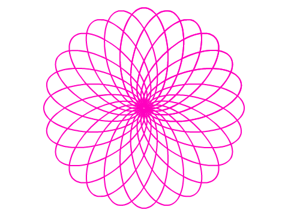

# Læringsmål {.tips}
+ beskrive og gjennomføre spegling, rotasjon og parallellforskyving
+ beskrive plassering og flytting i rutenett, på kart og i koordinatsystem, med og utan digitale hjelpemiddel, og bruke koordinatar til å berekne avstandar parallelt med aksane i eit koordinatsystem

# Introduksjon {.intro}

I denne oppgaven skal vi lage flotte kunstverk ved hjelp av enkle geometriske figurer og rotasjon.





# Steg 1: Forberedelser {.activity}


## Sjekkliste {.check}

+ Start et nytt prosjekt.
+ Slett kattefiguren ved å høyreklikke på den og velge `slett`.
+ Opprett en ny figur ved å trykke på pensel-ikonet. [BILDE]
+ Bytt til vektorgrafikk, og tegn en rettvinklet trekant ved hjelp av linje-verktøyet. Tips: Ved å holde inne Shift-tasten kan du lett tegne helt loddrette og vannrette linjer.
+ Velg senterverktøyet [BILDE] og plasser figurens senter midt i figuren.
+ Før vi begynner med selve oppgaven, skal vi legge inn en liten hjelpefunksjon:

	```blocks
	når [mellomrom v] trykkes
	slett
	skjul
	pek i retning [90 v]
	gå til x: (0) y: (0)
	slett denne klonen
	```


# Steg 2: Rotering

Vi skal nå lage et skript som roterer figuren vår og etterlater et stempelavtrykk for hver gang

## Sjekkliste {.check}

+ bla bla
	
	```blocks
	når [a v] trykkes
	lag klon av [meg v]
	```
	
	```blocks
	når jeg starter som klon
	vis
	gjenta (4) ganger
	stemple avtrykk
	vend høyre (90) grader
	```

## Test prosjektet {.flag}

+ Trykk A på tastaturet. Hva skjer?
+ Halver antall grader figuren skal roteres. Hva skjer nå? Hva må du gjøre for å fullføre en hel rotasjon denne gang?
+ Nå skal du få leke deg litt med koden. Prøv å endre på antall gjentakelser, hvor mange grader du roterer figuren, osv. Hva skjer om du legger inn en 
	
	```blocks
	gå (10) steg
	```
	
	i gjenta-løkken din?


# Steg 3: Litt mer avansert. {.activity}

+ Opprett en ny figur som i steg 1, men tegn en annen type figur. Eksempel er kvadrat, rektangel, sirkel og ellipse. 
+ Kopier så koden fra steg 1 og 2 over til den nye figuren.
+ Endre tasten som starter skriptet til noe annet enn A for denne figuren. La oss si at S er startknappen for vår nye figur:

	```blocks
	når [s v] trykkes
	Lag klon av [meg v]
	```

# Steg 4: Slipp din indre kunstner løs {.activity}
 
 + Forsøk å endre på kodene til de ulike figurene. Legg til nye bevegelsesblokker. Legg til flere figurer. Hvordan blir det om du lager irregulære figurer? 
 + Ved å høyretrykke på bildet kan du lagre det på PC-en og for eksempel skrive det ut. 
 + Lagre prosjektet ditt ved å gi det et navn. 

